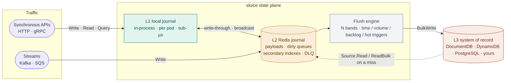
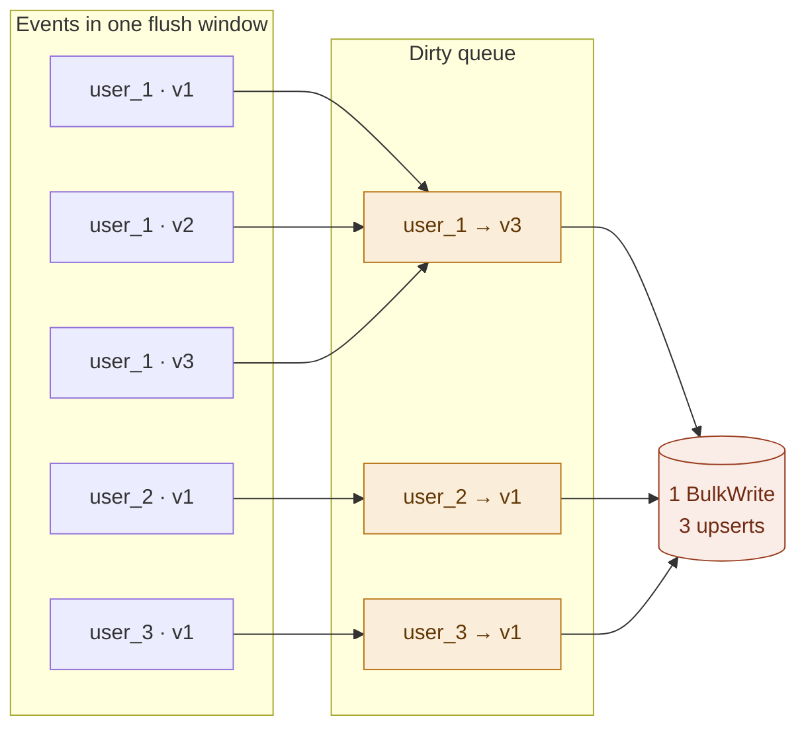
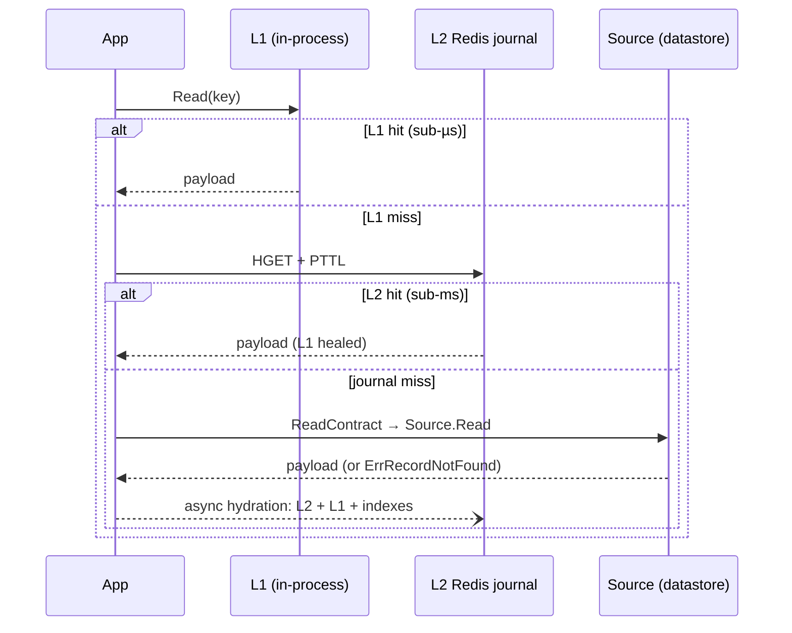

# sluice

[](https://github.com/hussainpithawala/sluice-go/actions/workflows/release.yml)
[](https://pkg.go.dev/github.com/hussainpithawala/sluice-go)
[](https://go.dev)
[](LICENSE)

> **A velocity data platform for Go.**
>
> Traffic arrives as fast as your users generate it; your datastore is built for a slower,
> steadier shape. `sluice` is a Redis-backed **state plane** between the two. It absorbs writes,
> serves reads, loads working sets and answers live queries at traffic speed. Your system of
> record only ever sees a few efficient batches.

One library and one state plane work with any datastore. First-class adapters exist for **AWS DocumentDB / MongoDB**,
**AWS DynamoDB**, and **PostgreSQL**.

---

## Why a velocity platform

Event-driven systems (ad-tech inventory, personalisation, session state, IoT telemetry) do not have
a data-*volume* problem. They have a data-*velocity* problem. Tens of thousands of small, uncoordinated
operations per second land on a datastore sized and priced for far fewer. The cost shows up in
different places depending on the store: index I/O on DocumentDB, WCU spend on DynamoDB, connection
and transaction overhead on PostgreSQL.

`sluice` takes that velocity off the store on every axis at once:

| Velocity axis | Without sluice | With sluice |
|---|---|---|
| **Write** | Every event is an individual write to the primary | Writes land in the journal in sub-ms, coalesce per key, and drain as one bulk write per band per window |
| **Read** | Every read is a datastore round-trip | In-process L1 (sub-µs) → Redis L2 (sub-ms) → datastore only on a miss |
| **Working set** | N+1 lookups to assemble a user's working set | One set-based query, hydrated into the journal in one pipeline |
| **Live state** | Ad-hoc queries, extra indexes or GSIs on the store | Compound equality/range queries over live state, answered from Redis |
| **Failure** | Bad records retry forever or are dropped | Quarantined in a DLQ, then healed and replayed on your schedule |

At the design envelope (a 100K events/sec spike across ~80K unique keys) this turns ~100,000 store
round-trips per second into ~100–130 bulk writes, **roughly 1,000× less I/O on the datastore.**

---

## The platform at a glance


```mermaid
flowchart LR
    subgraph P["Traffic"]
        direction TB
        STR(["Streams<br/>Kafka · SQS"])
        API(["Synchronous APIs<br/>HTTP · gRPC"])
    end

    subgraph S["sluice state plane"]
        direction TB
        L1["L1 local journal<br/>in-process · per pod · sub-µs"]
        L2[("L2 Redis journal<br/>payloads · dirty queues<br/>secondary indexes · DLQ")]
        FE["Flush engine<br/>N bands · time / volume / backlog / hot triggers"]
        L1 <-->|"write-through · broadcast"| L2
        L2 --> FE
    end

    DS[("L3 system of record<br/>DocumentDB · DynamoDB · PostgreSQL · yours")]

    STR -->|"Write"| L2
    API -->|"Write · Read · Query"| L1
    FE -->|"BulkWrite"| DS
    DS -.->|"Source.Read / ReadBulk on a miss"| L2

    style L1 fill:#E1F5EE,stroke:#0F6E56,color:#085041
    style L2 fill:#FAEEDA,stroke:#BA7517,color:#633806
    style FE fill:#F3F4F6,stroke:#6B7280,color:#374151
    style DS fill:#FAECE7,stroke:#993C1D,color:#712B13
```

| Capability | API | What it scales |
|---|---|---|
| [Absorb writes](#absorb-write-velocity) | `Write`, `WriteIdempotent` | Write rate reaching the store |
| [Serve reads](#serve-read-velocity) | `Read`, `ReadFresh`, `HotLoad`, `IsHot` | Read rate reaching the store |
| [Pre-warm working sets](#pre-warm-working-sets) | `ReadBulk`, `ReadBulkWithTTL` | N+1 lookups → one query |
| [Query live state](#query-live-state) | `Query` | Compound lookups without the store |
| [Converge across pods](#l1-local-journal-and-cross-pod-convergence) | `WithLocalCache` | Read latency, pod-to-pod consistency |
| [Recover from failures](#recover-dead-letter-queue) | `ProcessDLQ`, `WithDLQAutoProcess` | Poison records, schema drift |
| [Observe](#observability) | `WithMetrics`, `metrics/prometheus` | Everything above, plus durability alerts |

---

## Core concepts

**Correlation key.** Every record belongs to one key (a user ID, a CRN, a device ID). Writes to the
same key coalesce, reads are served per key, and each key hashes (FNV-32a) to one of `BandCount`
bands. The band is embedded in every Redis key as a `{band}` hash tag, so everything for a key lives
on one Redis Cluster slot.

**Contracts.** `sluice` never parses your data. You supply small functions that translate between
your payload bytes and your datastore's native operations:

| Contract | Signature | Enables |
|---|---|---|
| `WriteContract` | `(key, payload) → *WriteModel` | The flush engine and `Write` |
| `ReadContract` | `(key) → *source.ReadModel` | Cold-path `Read`, `HotLoad` |
| `IndexContract` | `(key, payload) → map[field]value` | Secondary indexes, `Query` |
| `ReadBulkContract` | `(lookupKey) → *source.BulkReadModel` | `ReadBulk` |
| `IndexBulkContract` | `([]BulkReadResult) → map[key]map[field]value` | Indexes for bulk-loaded items |

**Tiers.** L1 is an optional in-process LRU. L2 is the Redis journal: the authoritative live state
and the write buffer. L3 is your datastore (`Sink` for writes, `Source` for reads). A read falls
through the tiers; a write goes in at L2 (and L1) and reaches L3 asynchronously.

**Composable topologies.** `Build()` requires only a namespace and Redis. Every other part is
optional, and each operation checks its own dependencies when it's called. The same binary can therefore run as a
full pod, a reader-only gateway, a bulk pre-warmer or a write-only ingester. See
[Deployment topologies](#deployment-topologies).

---

## Install

```bash
go get github.com/hussainpithawala/sluice-go@latest
```

## Quickstart

A full pod on DocumentDB with a write path, a read path and live queries:

```go
import (
    sluice "github.com/hussainpithawala/sluice-go"
    "github.com/hussainpithawala/sluice-go/sink/docdb"
    "github.com/hussainpithawala/sluice-go/source"
    sourcedocdb "github.com/hussainpithawala/sluice-go/source/docdb"
    "go.mongodb.org/mongo-driver/bson"
)

sk, _ := docdb.New(ctx, docdb.DefaultConfig(mongoURI, "adroll", "nudge_inventory"))
src := sourcedocdb.NewSourceWithClient(sk.Client(), "adroll", "nudge_inventory") // one pool for both paths

writeContract := func(key string, payload []byte) (*sluice.WriteModel, error) {
    var doc map[string]any
    if err := json.Unmarshal(payload, &doc); err != nil {
        return nil, err
    }
    return &sluice.WriteModel{
        Filter: bson.D{{Key: "_id", Value: key}},
        Update: bson.D{{Key: "$set", Value: doc}},
        Upsert: true,
    }, nil
}

readContract := func(key string) (*source.ReadModel, error) {
    return &source.ReadModel{Filter: bson.M{"_id": key}}, nil
}

s, err := sluice.New("nudge_inventory").
    WithRedis(sluice.RedisConfig{Addrs: []string{"redis:6379"}}).
    WithSink(sk).
    WithWriteContract(writeContract).
    WithSource(src).
    WithReadContract(readContract).
    WithIndexContract(indexContract). // optional: enables Query()
    Build(ctx)
if err != nil {
    return err
}
defer s.DrainAndClose(ctx)

// Absorb: journaled in sub-ms, flushed to DocumentDB in batches.
err = s.Write(ctx, userID, payload)

// On login: mark the key hot and warm it from the store in the background.
_ = s.HotLoad(ctx, userID)

// During the session: served from the journal, no DocumentDB round-trip.
payload, err := s.Read(ctx, userID)

// Live compound query over journal-resident state.
results, err := s.Query(ctx, sluice.Query{
    Equality: map[string]string{"channel": "push"},
    RangeMin: map[string]float64{"priority": 3},
})
```

`Write` returning `nil` means the write is durably journaled and safe to ack upstream. Don't ack on
an error. See [Durability model](#durability-model).

---

## Absorb write velocity

Each `Write` runs one atomic Lua script in one round-trip. The script stores the payload, bumps a
per-key sequence, removes any TTL (unflushed state never expires) and `ZADD`s the key to its band's
dirty queue, scored by timestamp.

Because `ZADD` on an existing member only moves its score, repeated writes to a key **collapse to one
dirty entry** carrying the latest payload:


```mermaid
flowchart LR
    subgraph IN ["Events in one flush window"]
        E1["user_1 · v1"]
        E2["user_2 · v1"]
        E3["user_1 · v2"]
        E4["user_3 · v1"]
        E5["user_1 · v3"]
    end
    subgraph Q ["Dirty queue"]
        D1["user_1 → v3"]
        D2["user_2 → v1"]
        D3["user_3 → v1"]
    end
    BW[("1 BulkWrite<br/>3 upserts")]
    E1 & E3 & E5 --> D1
    E2 --> D2
    E4 --> D3
    D1 & D2 & D3 --> BW

    style D1 fill:#FAEEDA,stroke:#BA7517,color:#633806
    style D2 fill:#FAEEDA,stroke:#BA7517,color:#633806
    style D3 fill:#FAEEDA,stroke:#BA7517,color:#633806
    style BW fill:#FAECE7,stroke:#993C1D,color:#712B13
```

### The flush engine

One goroutine per band drains the oldest dirty keys, pipelines their payloads out of Redis, applies
the `WriteContract` and issues one unordered `BulkWrite`. Each goroutine wakes on whichever trigger
fires first:

| Trigger | Fires when | Purpose |
|---|---|---|
| Time | `FlushWindow` elapses (default 250ms) | Bounds datastore lag |
| Volume | Band depth ≥ `MaxBatchSize` (default 1000) | Bounds batch size and Redis memory during spikes |
| Backlog | A band's oldest dirty entry has waited ~`KeyTTL` (checked every `KeyTTL/2`) | Bounds flush latency for backlogged bands |
| Hot | `Write` lands on a hot key (`HotAwareFlush`) | Keeps the store current for keys under active use |

Keys are committed only after the sink confirms the batch, and the engine handles each result like this:

| Sink result | Engine action |
|---|---|
| Top-level error (network, timeout, write-concern failure) | Commit nothing; the whole batch stays dirty and is retried |
| A per-key error with an empty correlation key | Commit nothing (`sink.ErrUnattributedSinkError` goes to `OnFlush`); the whole batch is retried |
| A per-key error that is transient | That key stays dirty and is retried |
| A per-key error that is permanent | That key is dead-lettered (`permanent_sink_error`) |
| No error for a key | The key is committed |

A commit is conditional: it removes a dirty entry only if the key's sequence is unchanged. A newer
write that lands mid-flush therefore stays dirty and goes out in the next batch.

### Write-path options

| Option | Effect |
|---|---|
| `WithBatchedWrites(size, window)` | Concurrent writers share one Redis pipeline: ⌈N / size⌉ round-trips instead of N. Each `Write` still waits for its own entry and returns that entry's real error. Worth it above ~10K writes/sec with many writers. |
| `WithContentDedup(true)` | xxHash64 fingerprint per payload. An unchanged payload skips the dirty queue, indexes and flush, and the store never sees a write it already has. |
| `WriteIdempotent(ctx, key, payload, msgID)` | `SETNX` guard against upstream redelivery. Returns `ErrDuplicateIdempotencyKey` on a repeat; the guard is kept for `IdempotencyTTL` (default 4h). |

---

## Serve read velocity

Reads fall through the tiers, and each tier heals the one above it:


```mermaid
sequenceDiagram
    participant App
    participant L1 as L1 (in-process)
    participant L2 as L2 Redis journal
    participant L3 as Source (datastore)

    App->>L1: Read(key)
    alt L1 hit (sub-µs)
        L1-->>App: payload
    else L1 miss
        App->>L2: HGET + PTTL
        alt L2 hit (sub-ms)
            L2-->>App: payload (L1 healed)
        else journal miss
            App->>L3: ReadContract → Source.Read
            L3-->>App: payload (or ErrRecordNotFound)
            App--)L2: async hydration: L2 + L1 + indexes
        end
    end
```

| Method | Behaviour |
|---|---|
| `Read(ctx, key)` | L1 → L2 → L3. With L1 on, may be up to `LocalTTL` stale. |
| `ReadFresh(ctx, key)` | L2 → L3, bypassing L1. Use for checkout, payments and compliance reads. |
| `HotLoad(ctx, key)` | Marks the key hot synchronously and hydrates it from the store in the background. Call it on login; it never blocks on the store. |
| `IsHot(ctx, key)` | Whether the key has a payload resident in the journal. |

**Hot vs cold.** A *hot* key (one with a live marker from `HotLoad`) stays resident for
`ActivityWindow` (default 4h). Each flush re-arms that TTL, and steady read traffic keeps extending it: a
read refreshes the TTL once it falls below 20% of the window. A *cold* key stays only `KeyTTL`
(default 30s) after it is flushed. Redis memory therefore tracks your active-key count, not your
total key space.

**Hydration never lies.** Read-through, `HotLoad` and `ReadBulk` hydration only fill a journal
*miss*. Every write reaches the journal before the store, so an existing entry is always at least
as new as a store read; it wins, and only its TTL is extended. Hydrated data is never marked dirty,
so store data is never flushed back to the store, and reader-only pods never build a backlog.

### L1 local journal and cross-pod convergence

An optional, sharded in-process LRU sits in front of the journal. Writes go through to the local L1 and are
broadcast to peer pods on a Redis Stream (`sl:{ns}:bcast`). The `XADD` piggy-backs on the journal
write's pipeline, so the broadcast costs no extra round-trip. Each peer applies updates behind a timestamp **version
gate**, so an out-of-order replay can never regress newer state.

```go
sl, _ := sluice.New("nudge_inventory").
    // ...
    WithLocalCache(localjournal.LocalCacheConfig{
        Mode:       localjournal.LocalCachePushPull, // Off (default) · Lazy · PushPull
        MaxEntries: 200_000,                         // global LRU cap across 256 shards
        LocalTTL:   60 * time.Second,                // staleness bound
        Broadcast:  shield.BroadcastPayload,         // or BroadcastInvalidation (~40B/msg, peers refetch)
        Retention:  200_000,                         // stream MAXLEN ~ N
    }).
    Build(ctx)
```

| Mode | Behaviour |
|---|---|
| `LocalCacheLazy` | Filled on demand from L2 and bounded by `LocalTTL`; no broadcast |
| `LocalCachePushPull` | Lazy fill, plus a stream subscriber that applies peer writes |

> `LocalCacheConfig` and the broadcast-mode constants currently live in `internal/` packages, so they
> can only be named from inside this module, as the bundled examples do.

---

## Pre-warm working sets

Many access patterns are set-shaped: *"all active campaigns for this user"*, *"the last 50
transactions on this account"*. `ReadBulk` runs **one** set-based query for a lookup key. It then
hydrates every returned item into L2, the secondary indexes and L1 in pipelined passes. After that,
per-key `Read` and `Query` never touch the store.

```go
sl, _ := sluice.New("campaigns").
    WithRedis(sluice.RedisConfig{Addrs: redisAddrs}).
    WithSource(pgsource.NewSourceWithPool(pool)).
    WithReadBulkContract(func(userID string) (*source.BulkReadModel, error) {
        return &source.BulkReadModel{
            Query: pgsource.PostgresBulkReadModel{
                Query: `SELECT id, json_build_object('id', id, 'status', status, 'priority', priority)
                        FROM campaigns WHERE user_id = $1 LIMIT 50`,
                Args:  []any{userID},
                Projector: func(rows pgx.Rows) ([]source.BulkReadResult, error) {
                    var out []source.BulkReadResult
                    for rows.Next() {
                        var r source.BulkReadResult
                        if err := rows.Scan(&r.CorrelationKey, &r.Payload); err != nil {
                            return nil, err
                        }
                        out = append(out, r)
                    }
                    return out, rows.Err()
                },
            },
        }, nil
    }).
    WithIndexBulkContract(campaignIndexes). // optional: makes bulk-loaded items queryable
    Build(ctx)

payloads, err := sl.ReadBulk(ctx, "user_123")              // map[key][]byte
payloads, ttls, err := sl.ReadBulkWithTTL(ctx, "user_123") // + remaining journal TTL (ms)
```

| Adapter | Native bulk plan | Projector input |
|---|---|---|
| `source/postgres` | `PostgresBulkReadModel{Query, Args}` | `pgx.Rows` |
| `source/docdb` | `DocDBBulkReadModel{Filter, FindOptions}` | `*mongo.Cursor` |
| `source/dynamodb` | `DynamoBulkReadModel{QueryInput}` (single page on a partition key) | `[]map[string]types.AttributeValue` |

Keys already in the journal (for example, a pending `Write`) are returned from the journal, not
overwritten with store data. Bulk-hydrated items live for `ActivityWindow`. `sluice` does not cap
projector output, so bound your queries with `LIMIT`, `SetLimit` or `QueryInput.Limit`.

---

## Query live state

An `IndexContract` projects index fields out of each payload. `sluice` keeps those indexes in Redis
as writes land, and `Query` answers compound lookups from the journal:

```go
func indexContract(key string, payload []byte) (map[string]interface{}, error) {
    var p Nudge
    if err := json.Unmarshal(payload, &p); err != nil {
        return nil, err
    }
    return map[string]interface{}{
        "channel":  p.Channel,                        // string  → equality SET
        "priority": float64(p.Priority),              // float64 → range ZSET
        "expires":  float64(p.ExpiresAt.UnixMilli()), // float64 → range ZSET
    }, nil
}

results, err := s.Query(ctx, sluice.Query{
    Equality: map[string]string{"channel": "push"},
    RangeMin: map[string]float64{"priority": 3},
    RangeMax: map[string]float64{"expires": float64(deadline.UnixMilli())},
}) // []QueryResult{CorrelationKey, Payload}
```

- `string` values build equality `SET`s; `float64`/`int64` values build range `ZSET`s; other types
  are ignored. At least one equality filter is required.
- Queries run per band, and every operand shares the band's hash tag, so intersections never cross
  a cluster slot. Index writes are plain pipelines (no Lua, no `cjson`), which makes them safe on Valkey.
- Indexes follow their payloads. A per-band expiry queue prunes an index entry within about a second of
  its payload expiring, and a periodic sweep (`WithIndexSweepInterval`, default 15s per band) acts as
  a safety net.
- Index maintenance is best-effort and never fails the primary write.

`Query` sees what is resident in the journal: hot keys, bulk-loaded sets and in-flight writes. It is
a live-state lookup, not a replacement for querying your datastore.

---

## Recover: dead-letter queue

Records that fail non-retryably are moved to a per-band DLQ instead of being retried forever or dropped.
Examples include a `WriteContract` error, a unique-index collision, a schema violation, or a payload
missing at flush time. Their payloads are kept for 7 days. Each sink isolates a permanent failure to
the offending rows, so one poison record never stalls its band; the rest of the batch commits.

| Dead-letter reason | Cause |
|---|---|
| `contract_violation` | `WriteContract` returned an error |
| `permanent_sink_error` | The sink classified the key's error as permanent (see [Error classification](#error-classification-for-sinks)) |
| `payload_missing_before_flush` | The key was dirty but its payload was gone |

```go
result, err := s.ProcessDLQ(ctx, sluice.DLQUpsert,
    sluice.WithDLQBatchSize(500),
    sluice.WithDLQLogger(slog.Default()),
) // DLQResult{Processed, Succeeded, Failed}

// Or let sluice run it on a ticker (stopped by DrainAndClose):
sluice.New("ns"). /* ... */ WithDLQAutoProcess(2*time.Minute, sluice.DLQUpsert)
```

| Strategy | Behaviour |
|---|---|
| `DLQIgnore` | Log and discard |
| `DLQUpsert` | Re-run the `WriteContract` and force an upsert |
| `DLQReInsert` | Re-enqueue under a mutated key (`WithKeyMutator`; a timestamp suffix by default), keeping both documents |

**Payload healing.** `DLQUpsert` re-runs your `WriteContract`, so the contract can repair
quarantined records at recovery time. For example, it can map an invalid field to a safe value
while a healing flag is set.
[`examples/ticker_dlq`](examples/ticker_dlq) schedules DLQ processing in-process, and
[`examples/asynq_dlq`](examples/asynq_dlq) schedules it across replicas with
[Asynq](https://github.com/hibiken/asynq).

---

## Durability model

A velocity platform is only useful if acknowledged data is never silently lost. `sluice` prefers a
loud failure to a quiet drop:

| Guarantee | How |
|---|---|
| **Ack means journaled** | `Write` returns `nil` only after its entry is in Redis. This holds in batched mode too: each caller gets its own entry's result. |
| **Unflushed state never expires** | Payloads are persistent until the sink confirms them. TTLs (`KeyTTL`, `ActivityWindow`) apply only *after* a commit, and TTL refreshes are extend-only. |
| **Commits can't lose concurrent writes** | Every write bumps a per-key sequence, and commit and dead-lettering are conditional on it. A write that races an in-flight flush stays dirty. |
| **No commit without attribution** | A sink error with no correlation key aborts the commit for the whole batch, both in the flush engine and in DLQ `Upsert` replay. Nothing is committed just because no error named it. |
| **Retry vs. dead-letter is explicit** | Every bundled sink classifies each error as transient or permanent. A concurrent-upsert race between pods is retried, not dead-lettered. |
| **At-least-once to the store, idempotent by upsert** | A crash between `BulkWrite` and commit re-flushes the batch. Upsert semantics make that safe. |
| **Losses are loud** | A dirty key whose payload is gone at flush time gets `ErrPayloadMissing` (via `OnFlush`), an error log, a `RecordUnflushedExpiry` count and a DLQ entry. **Any non-zero count should page.** |
| **Degraded mode preserves order** | If Redis fails, `WithDegradedModeDirect` (default on) writes straight to the store *only* when no older version of the key is pending in Redis. Otherwise, including when Redis is unreachable, `Write` returns `ErrDegradedWriteUnsafe`. Retry it; don't ack it. |
| **Survives script-cache loss** | Every Lua call site reloads and retries once on `NOSCRIPT`, which covers a Redis restart, failover or `SCRIPT FLUSH`. |

**Run the journal on durable Redis.** Use `maxmemory-policy noeviction` (eviction would drop
unflushed state) plus AOF and replicas, or MemoryDB. ElastiCache alone does not persist unflushed
writes across node loss. The bundled `docker-compose.yml` runs Redis with `noeviction` and
`appendfsync everysec`.

The sink-level silent-loss paths found during the event-log review have been closed. The design and
test plan are in [RFP #18](docs/issues/sink-silent-loss.md).

---

## Deployment topologies

| Topology | Configure | Use case |
|---|---|---|
| **Full pod** | `Sink` + `WriteContract` + `Source` + `ReadContract` (+ bulk/index contracts) | Stream ingestion and read APIs in one service |
| **Reader-only gateway** | `Source` + `ReadContract` / `ReadBulkContract`, no sink | Stateless API pods reading the journal written by full pods; they fall back to the store and hydrate, but never write to it |
| **Bulk pre-warmer** | `Source` + `ReadBulkContract` + `IndexBulkContract` | A job that loads active users' working sets ahead of peak traffic |
| **Write-only ingester** | `Sink` + `WriteContract`, no source | High-velocity consumers that never serve reads |

The flush engine starts only when both a sink and a `WriteContract` are configured. Operations check
their own dependencies when called:

| Operation | Requires | When missing |
|---|---|---|
| `Write`, `WriteIdempotent`, `ProcessDLQ` | `Sink` + `WriteContract` | `ErrMissingSink` / `ErrMissingWriteContract` |
| `Read`, `ReadFresh` | Redis; `Source` + `ReadContract` for the cold path | `ErrRecordNotFound` on a full miss |
| `HotLoad` | `Source` + `ReadContract` | `ErrMissingSource` / `ErrMissingReadContract` |
| `ReadBulk`, `ReadBulkWithTTL` | `Source` + `ReadBulkContract` | error |
| `Query` | `IndexContract` and/or `IndexBulkContract` | empty result |

`DrainAndClose` is safe on every topology. It stops the write batcher, drains the flush engine and
closes the sink (when configured).

---

## Datastore adapters

Each adapter uses the journal to remove the bottleneck specific to its store:

| Store | Sink | Source | Bottleneck removed |
|---|---|---|---|
| DocumentDB / MongoDB | `sink/docdb`: unordered `BulkWrite` | `source/docdb`: `FindOne`; `Find` for bulk | Per-write index I/O on a single primary; connection caps |
| DynamoDB | `sink/dynamodb`: `BatchWriteItem`, with `UnprocessedItems` mapped back to their keys and retried | `source/dynamodb`: `GetItem` with `ConsistentRead: true`; `Query` for bulk | WCU spend: bursts flatten to a low, steady provisioned baseline; secondary lookups use Redis indexes instead of GSIs; idempotency uses `SETNX` instead of `TransactWriteItems` |
| PostgreSQL | `sink/postgres`: multi-row `INSERT … ON CONFLICT DO UPDATE` (or `DO NOTHING` via `Config.OnConflict`) | `source/postgres`: parameterised query + `Projector`, which supports joins and aggregations | Connection saturation, per-row transaction overhead, WAL/MVCC churn from repeated updates |

How each bundled sink classifies failures:

| Sink | Transient (retried) | Permanent (dead-lettered) | Whole batch retried |
|---|---|---|---|
| `sink/docdb` | 11000 on `_id_` for an upsert (a race with another pod) | Any other write error, including 11000 on a business unique index | Write-concern error, network or context error |
| `sink/dynamodb` | `UnprocessedItems`, context cancel/deadline | `Update` not a `map[string]any`, missing PK/SK attribute, marshal failure, duplicate key in the batch, a per-item `PutItem` failure after a `ValidationException` fallback | An unprocessed item that can't be mapped to a key; any other API error |
| `sink/postgres` | Any other SQLSTATE | `23xxx`, `42P01`, `42703`, `21000`; a row whose columns differ from the batch's first row; a duplicate conflict key in the batch | A non-Postgres error (for example, a connection failure) |

On a permanent multi-row error, `sink/postgres` retries the batch row by row, so only the bad rows are
dead-lettered. On a batch-wide `ValidationException`, `sink/dynamodb` falls back to per-item `PutItem`
calls for the same reason.

`sluice` never creates tables or emits DDL. Your contracts define the data shape, and your migrations
own the schema. The design RFCs for each adapter are in [`docs/issues/`](docs/issues)
([DynamoDB](docs/issues/hybrid-dynamo.md), [PostgreSQL](docs/issues/postgres-hybrid-adapter.md)).

**Bring your own store** by implementing two small interfaces:

```go
type FlushSink interface {
    BulkWrite(ctx context.Context, models []sink.WriteModel) (*sink.BulkWriteResult, error)
    Write(ctx context.Context, model sink.WriteModel) error // degraded-mode path
    Ping(ctx context.Context) error
    Close(ctx context.Context) error
}

type Source interface {
    Read(ctx context.Context, model source.ReadModel) ([]byte, error) // source.ErrRecordNotFound on miss
    ReadBulk(ctx context.Context, model source.BulkReadModel) ([]source.BulkReadResult, error)
    Ping(ctx context.Context) error
    Close(ctx context.Context) error
}
```

### Error classification for sinks

The engine never infers success. A custom `FlushSink` must report every failure it knows about:

- **Total failure:** return a non-nil `error` and nothing is committed. Use this when the sink can't
  tell which keys failed.
- **Per-key failure:** return a `sink.SinkError` in `BulkWriteResult.Errors` with the key's
  `CorrelationKey` and a `Class`. An error with an empty `CorrelationKey` aborts the commit for the
  whole batch (`sink.ErrUnattributedSinkError`).

```go
res.Errors = append(res.Errors, sink.SinkError{
    CorrelationKey: m.CorrelationKey,
    Code:           code,                // store-specific; optional
    Class:          sink.ClassPermanent, // or sink.ClassTransient
    Err:            err,
})
```

| `Class` | Engine action |
|---|---|
| `ClassTransient` | The key stays dirty and is retried |
| `ClassPermanent` | The key is dead-lettered as `permanent_sink_error` |
| `ClassUnknown` (zero value) | Legacy behaviour: dead-lettered if `Code == 11000`, otherwise retried |

`SinkError.IsPermanent()` implements this rule, and `sink.CheckAttribution(models, result)` is the
same guard the engine runs.

---

## Observability

`metrics/prometheus` is a ready-made `MetricsRecorder`:

```go
import sluiceprom "github.com/hussainpithawala/sluice-go/metrics/prometheus"

rec := sluiceprom.NewRecorder("nudge_inventory") // registers on prometheus.DefaultRegisterer
s, _ := sluice.New("nudge_inventory"). /* ... */ WithMetrics(rec).Build(ctx)

mux := http.NewServeMux()
mux.Handle("/metrics", promhttp.Handler())
go http.ListenAndServe(":2112", mux)
```

Use `NewRecorderWithRegistry(ns, reg)` to run several instances in one process; `rec.Unregister(reg)` removes
them again. The namespace must be a valid Prometheus identifier. Metrics are named
`sluice_<namespace>_<metric>`:

| Area | Metrics |
|---|---|
| Write path | `write_total`, `degraded_write_total{error}`, `redis_op_duration_seconds{op,error}` |
| Flush engine | `flush_duration_seconds{band,error}`, `flush_batch_size{band}`, `dirty_queue_depth{band}` |
| Read path | `read_duration_seconds{is_hot,error}`, `warmup_duration_seconds{error}`, `hot_set_size` |
| L1 / broadcast | `local_cache_hit_total`, `local_cache_miss_total{reason}`, `local_set_size`, `broadcast_lag_seconds` |
| Failures | `contract_error_total{correlation_key}`, `dead_letter_total{band}`, `dlq_process_total{strategy,outcome}` |
| Durability | `unflushed_expiry_total{band}`: **data loss, must stay 0** |

Signals worth watching:
- A falling `is_hot="true"` share of reads means sessions age out before their traffic ends, so raise `ActivityWindow`.
- The L1 hit ratio tells you how to size `MaxEntries` and `LocalTTL`.
- `op="degraded_refused"` counts writes refused to preserve ordering.

**Ready-made assets:**
- A Grafana dashboard: [`dashboards/sluice-overview.json`](dashboards/sluice-overview.json).
- Alert rules: [`monitoring/prometheus/rules/sluice.rules.yml`](monitoring/prometheus/rules/sluice.rules.yml), covering unflushed loss, degraded refusals, flush latency, backlog, L1 hit ratio, broadcast lag and DLQ inflow.
- `make docker-up` provisions Prometheus (`:9090`) and Grafana (`:3000`) locally.

For Datadog, CloudWatch or anything else, implement `MetricsRecorder` yourself. Its methods are
`RecordWrite`, `RecordDegradedWrite`, `RecordRedisOp`, `RecordFlush`, `RecordDirtyQueueDepth`,
`RecordContractError`, `RecordDeadLetter`, `RecordDLQProcess`, `RecordUnflushedExpiry`,
`RecordRead`, `RecordWarmUp`, `RecordHotSetSize`, `RecordLocalCacheHit`, `RecordLocalCacheMiss`,
`RecordLocalSetSize` and `RecordBroadcastLag`. Gauge sampling (`WithHotSetSampleInterval`) starts only with a
non-noop recorder. More detail is in [`docs/issues/prometheus.md`](docs/issues/prometheus.md).

---

## Configuration reference

| Builder method | Default | Description |
|---|---|---|
| **Core** | | |
| `WithRedis(cfg)` | — | **Required.** Redis/Valkey connection: `Addrs`, `ClusterMode`, auth, timeouts, `PoolSize`, `TLSConfig` |
| `WithBandCount(n)` | `16` | Parallel flush partitions |
| `WithMetrics(m)` | noop | `MetricsRecorder` implementation |
| **Write path** | | |
| `WithSink(s)` · `WithWriteContract(fn)` | nil | Both required to start the flush engine |
| `WithFlushWindow(d)` | `250ms` | Time trigger; bounds datastore lag |
| `WithMaxBatchSize(n)` | `1000` | Keys per bulk write; volume trigger threshold |
| `WithKeyTTL(d)` | `30s` | Post-flush TTL for cold payloads; backlog trigger threshold |
| `WithBatchedWrites(size, window)` | off | Pipeline concurrent `Write`s into shared round-trips |
| `WithContentDedup(bool)` | `false` | Skip unchanged payloads (xxHash64) |
| `WithIdempotencyTTL(d)` | `4h` | Retention of `WriteIdempotent` guards |
| `WithDegradedModeDirect(bool)` | `true` | Order-safe direct writes when Redis fails |
| `OnFlush(cb)` | nil | Called after every bulk write attempt with its keys, result and error |
| **Read path** | | |
| `WithSource(s)` | nil | Read-side datastore |
| `WithReadContract(fn)` | nil | Enables cold `Read` and `HotLoad` |
| `WithReadBulkContract(fn)` | nil | Enables `ReadBulk` |
| `WithActivityWindow(d)` | `4h` | Residency of hot and hydrated keys |
| `WithHotAwareFlush(bool)` | `true` | Flushed hot keys keep `ActivityWindow`; writes to hot keys flush immediately |
| `WithLocalCache(cfg)` | off | L1 local journal; see [above](#l1-local-journal-and-cross-pod-convergence) |
| **Indexes** | | |
| `WithIndexContract(fn)` · `WithIndexBulkContract(fn)` | nil | Enable `Query` for written / bulk-loaded keys |
| `WithIndexSweepInterval(d)` | `15s` | Full index sweep cadence; `-1` disables the sweep only |
| **Operations** | | |
| `WithDLQAutoProcess(interval, strategy)` | off | Background DLQ processing |
| `WithHotSetSampleInterval(d)` | `30s` | `hot_set_size` sampling (uses SCAN); negative disables it |

## Errors

All errors are sentinels, comparable with `errors.Is`.

| Error | Returned by | Meaning |
|---|---|---|
| `ErrRecordNotFound` | `Read`, `ReadFresh` | Not in the journal or the source |
| `ErrDuplicateIdempotencyKey` | `WriteIdempotent` | Already processed; ack and move on |
| `ErrRedisUnavailable` | `Write` | Redis failed and degraded mode is off |
| `ErrDegradedWriteUnsafe` | `Write` | Redis failed and a direct write could be reordered (wraps `ErrRedisUnavailable`); retry, don't ack |
| `ErrContractViolation` | degraded `Write` | `WriteContract` rejected the payload |
| `ErrPayloadMissing` | `OnFlush` callback | A dirty key's payload was gone at flush time; dead-lettered |
| `ErrMissingSink` · `ErrMissingWriteContract` | write-path methods | Write path not configured on this instance |
| `ErrMissingSource` · `ErrMissingReadContract` | `HotLoad` | Read path not configured |
| `ErrEmptyCorrelationKey` | `Write`, `WriteIdempotent` | Empty correlation or idempotency key |
| `ErrLibraryClosed` | every method | Called after `DrainAndClose` |
| `ErrMissingNamespace` · `ErrMissingRedis` | `Build` | Required builder option not set |

<details>
<summary><b>Redis key layout</b></summary>

Every per-key and per-band key embeds `{band}` as a cluster hash tag. A namespace containing `{` or
`}` is rejected by `Build()`.

| Key | Type | TTL | Purpose |
|---|---|---|---|
| `sl:{ns}:payload:{band}:{key}` | `HASH`: `p` payload, `ts`, `v` sequence, `h` content hash | none until flushed; then `KeyTTL`, or `ActivityWindow` if hot | Journaled state |
| `sl:{ns}:dirty:{band}` | `ZSET` scored by write time | none | Pending-flush queue |
| `sl:{ns}:hot:{band}:{key}` | `STRING` | `ActivityWindow` | Hot marker |
| `sl:{ns}:idx:{band}:{field}:{value}` | `SET` | `ActivityWindow` | Equality index |
| `sl:{ns}:ridx:{band}:{field}` | `ZSET` scored by value | `ActivityWindow` | Range index |
| `sl:{ns}:idxv:{band}:{key}` | `HASH` | follows payload | A key's current index values |
| `sl:{ns}:idxreg:{band}` · `sl:{ns}:idxexp:{band}` | `SET` · `ZSET` | — | Index registry and expiry queue |
| `sl:{ns}:idem:{band}:{idemKey}` | `STRING` | `IdempotencyTTL` | `WriteIdempotent` guard |
| `sl:{ns}:dlq:{band}` | `ZSET` scored by failure time | none (payloads 7 days) | Dead-letter queue |
| `sl:{ns}:bcast` | `STREAM` | `MAXLEN ~ Retention` | L1 cross-pod broadcast |

</details>

---

## Examples and local development

Examples live under `examples/<scenario>/<adapter>/`, where `<adapter>` is `documentdb`, `dynamodb` or `postgres`.
`docker-compose.yml` runs Redis/Valkey (standalone, cluster and TLS), MongoDB, DynamoDB Local,
PostgreSQL, Kafka, LocalStack, Prometheus and Grafana, so no cloud account is needed.

```bash
make docker-up                                     # start all services
make list-examples                                 # list runnable examples
make run-example DIR=examples/bulk_read/postgres   # run one
make docker-down
```

| Scenario | Demonstrates |
|---|---|
| `nudge` | Minimal write + flush |
| `nudge_hot_reload` | `HotLoad`, tiered `Read`, `IsHot`, dedup, `Query` |
| `nudge_write_dual_read_hot` | Full lifecycle: stream writes and API writes, unified reads, compound queries, `/metrics` |
| `bulk_read` | `ReadBulk` pre-warming, then journal-served `Read` and `Query` |
| `localjournal_pushpull` | L1 cross-pod convergence, including split `reader/` and `writer/` processes |
| `ticker_dlq` · `asynq_dlq` | DLQ healing with in-process and distributed schedulers |
| `nudge_prometheus` | Prometheus recorder, dashboard and alerts |
| `nudge_secured` | TLS Redis |

```bash
make test-unit          # unit tests against real Redis, MongoDB, DynamoDB Local and PostgreSQL
make test-integration   # full stack, including Kafka and LocalStack
make check              # tidy + vet + lint + unit tests
make coverage           # HTML coverage report
```

---

## Roadmap

- **Event log** ([RFP #17](docs/issues/event-log.md), proposed): `WriteEvent`, which records *every*
  event exactly once alongside the coalesced state document. This is for reporting and growth analytics,
  where each event is a fact. It builds on the sink error classification from RFP #18.
- Design notes for shipped features: [bulk reader](docs/issues/bulkreader.md),
  [local journal](docs/issues/local-journal.md), [Prometheus](docs/issues/prometheus.md),
  [sink silent-loss fixes](docs/issues/sink-silent-loss.md).

Release history and breaking changes are in [CHANGELOG.md](CHANGELOG.md).

## License

MIT; see [LICENSE](LICENSE).
