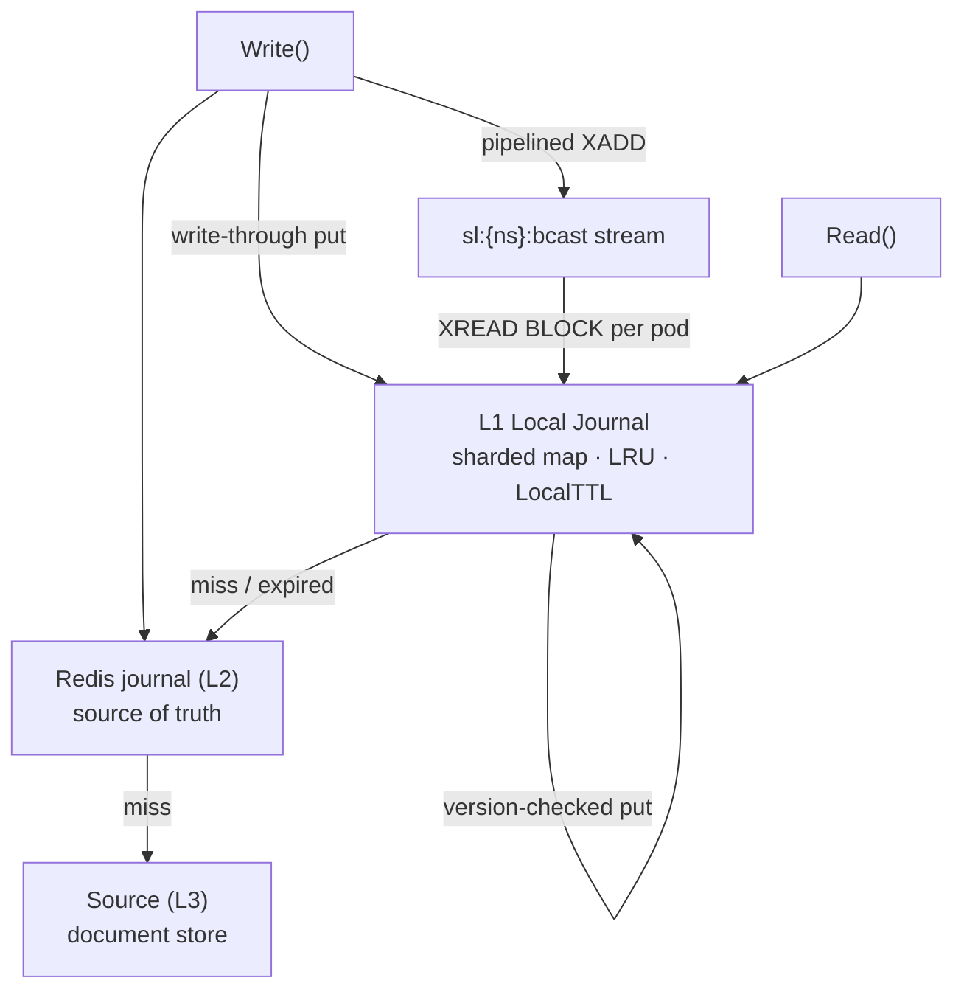
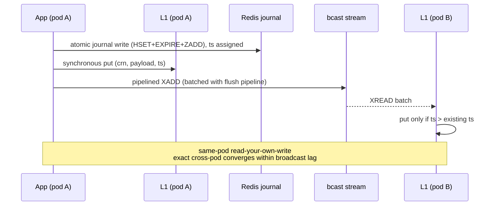

# RFC — Sluice-go Local Journal (L1): In-Process Read Tier with Stream-Based Update Propagation

| | |
|---|---|
| **Document** | RFP-001 (Revision 2) |
| **Status** | Proposed for review — Phase 2 exit criteria expanded |
| **Date** | 2026-09-11 |
| **Target release** | sluice-go v1.1.0 (opt-in, default-off) |
| **Affected surfaces** | `sluice` builder & read path · `internal/shield` (broadcast) · new `internal/localjournal` package |
| **Companion docs** | README "Hot/Cold regime", RFP-000 (Hot/Cold regime design review), [hybrid-dynamo.md / Issue #8](https://github.com/hussainpithawala/sluice-go/issues/8) (DynamoDB adapter — shares the Redis journal this proposal adds write load to) |

---

## 1. Executive summary

sluice-go's hot read path currently serves every `Read()` for an active correlation key from the Redis journal (L2). At fleet scale this concentrates read traffic on the shard holding each hot key — a **hot-shard problem that cluster scaling cannot relieve**, because a hash-tagged key lives on exactly one slot. The conventional remedy (read replicas) adds node cost, cross-AZ egress, replication lag, and still pays a network hop per read.

This proposal introduces an **L1 in-process read tier** ("Local Journal"): a bounded, versioned, demand-filled memory cache per pod, kept fresh by a **Redis Streams broadcast channel** rather than Redis Pub/Sub. Reads resolve L1 → L2 → Source; writes remain journaled in Redis exactly as today, with a pipelined broadcast entry appended so peer pods converge within milliseconds.

Expected outcome at reference scale (20 pods, 60K hot reads/s, 6K hot writes/s): **~6× reduction in Redis operations**, hot-read p99 moving from ~0.5–1 ms to **~1–5 µs**, at a cost of ~150–250 MB RAM per pod — with no replica infrastructure. This estimate is bounded to reference scale; §7.1 adds the higher-scale and shared-load checks this revision requires before Phase 2 sign-off.

---

## 2. Problem statement

### 2.1 Hot-shard concentration
Every journal key embeds a `{band}` hash tag for cluster safety. Consequently all reads for a hot CRN land on one shard. Fleet-wide read scaling does not help a single hot key; adding shards adds capacity for *other* keys only.

### 2.2 Why replicas are the expensive answer

| Dimension | Read replica | L1 Local Journal (this proposal) |
|---|---|---|
| Read latency | ~1–2 ms (network + lag) | ~1–5 µs (process memory) |
| Cost | replica node(s) + cross-AZ egress | pod RAM (~200 MB) |
| Freshness | replication lag | broadcast lag (ms), bounded by `LocalTTL` |
| Redis outage behaviour | reads fail | bounded-stale reads continue (resilience gain) |
| Operational surface | replica monitoring, failover semantics | one config block, three metrics |

### 2.3 Why naive pub/sub push-to-all-pods is insufficient
The original intuition — the `HotLoad`-initiating pod streams copies to all peers — is directionally correct but fails on three mechanics:
1. **Pub/Sub is fire-and-forget.** A restarting or late-joining pod silently misses updates and serves stale payloads indefinitely.
2. **Full-copy push amplifies memory** by pod count (2M hot keys × 1 KB ≈ 2 GB *per pod*).
3. **Unversioned messages** allow a Redis-healed read to be regressed by an older broadcast arriving afterwards.

---

## 3. Goals and non-goals

**Goals**
- G1: Reduce hot-path Redis read operations by ≥5× at reference scale.
- G2: Preserve the existing correctness backstop: Redis journal remains source of truth; L1 can never serve *wrong* data, only *bounded-stale* data.
- G3: Keep the feature opt-in and default-off in v1.1.0; zero behaviour change when disabled.
- G4: Remain cluster-safe (Redis Cluster / Valkey / ElastiCache CME) and Valkey-compatible (no new Lua, no `cjson`).
- G5: Expose an explicit strong-consistency escape hatch (`ReadFresh`).
- G6 (new): Demonstrate that the broadcast write added to the hot write path does not reintroduce the Redis main-thread saturation previously observed and fixed via CME sharding during the standalone→cluster migration.

**Non-goals**
- N1: No change to the write path's durability or two-phase commit semantics.
- N2: No L1 support for `Query()` in v1.1.0 (indexes stay in Redis).
- N3: No cross-pod coordination beyond the broadcast stream (no consensus, no leader election).
- N4: No replacement of the Source fallback for cold keys.

---

## 4. Conclusive design principles (carried from the design review)

| # | Principle | Rationale |
|---|---|---|
| C1 | **L1 in-process cache is the correct lever** | Hot-shard concentration is a read-locality problem; solve it at the reader, not by duplicating the store. |
| C2 | **Streams, not Pub/Sub** | `XADD` retention gives a backlog: blips resume from cursor, new pods read history, gaps are detectable. |
| C3 | **Version every message** | Carry the journal write timestamp (`ts`). Local puts apply only if `ts > existing ts`; Redis-heal vs broadcast races become unwinnable. |
| C4 | **Demand-fill, push-update, cap memory** | Populate on first miss (or `HotLoad` seed); broadcasts keep entries fresh; `MaxEntries` LRU + `LocalTTL` bound the working set. |
| C5 | **Lazy heal is the correctness backstop** | L1 miss/expired → `ReadWithTTL` from Redis → repopulate. A lost or trimmed stream degrades to *more Redis reads*, never to wrong data. |
| C6 | **Phase the rollout** | Ship `Lazy` first (no new infrastructure), then `PushPull`, then optional sticky routing. |

---

## 5. Proposed design

### 5.1 Three-tier read path



### 5.2 Local store (`internal/localjournal`)
- Sharded map (256 shards by key hash) with per-shard `RWMutex`; entry = `{payload, version(ts), expiresAt}`.
- Eviction: `MaxEntries` global LRU + per-entry expiry sweep.
- `LocalTTL` (default 60 s) is the **staleness and memory dial**: it bounds both how stale an un-refreshed entry may be and the per-pod working set.

### 5.3 Broadcast channel and message schema
- Single stream key `sl:{ns}:bcast` (default); per-band streams (`sl:{ns}:bcast:{band}`) reserved as a config option if stream-shard load ever matters.
- Retention: `XADD ... MAXLEN ~ 200000` (≈30 s of hot-write traffic at reference scale) — enough for blips; longer gaps heal lazily.
- Message fields: `{crn, band, ts, kind, payload?}` where `kind ∈ {upsert, seed, touch}` and `payload` is present only in `BroadcastPayload` mode.
- Each pod runs one blocked `XREAD` loop from its own cursor; lag = `streamLastID − cursor` is a first-class metric.
- **Write-rate ceiling (elevated from open question, see §7.1):** this key is intentionally un-hash-tagged (single key = single slot — consistent with, not a regression of, the hash-tag discipline established during the CME migration). That correctly avoids CROSSSLOT risk, but it also means the key's load is **aggregate fleet write-rate**, not per-shard write-rate. This must be load-tested against real payment-rail write volumes, not just the reference 6K writes/s figure, before Phase 2 sign-off — see §7.1.

### 5.4 Write-path integration



The broadcast enqueue rides the existing batcher pipeline (one `XADD` per entry alongside `EVALSHA`), so no additional *round-trips* are introduced on the write hot path. It does, however, add one additional command for Redis's single-threaded command loop to execute per write — see §7.1 for why this needs explicit validation rather than being assumed free.

### 5.5 Read-path algorithm

```go
func (s *Sluice) Read(ctx context.Context, crn string) ([]byte, error) {
    if e, ok := s.local.Get(crn); ok && !e.Expired() {          // L1
        s.metrics.RecordLocalCacheHit(ns); return e.Payload, nil
    }
    payload, pttl, ts, err := s.shield.ReadWithTTL(ctx, crn)   // L2 (heal + revalidate)
    if err == nil && payload != nil {
        s.local.Put(crn, payload, ts, expiryFrom(pttl)); return payload, nil
    }
    return s.coldRead(ctx, crn)                                // L3 Source
}
```

### 5.6 Broadcast modes

| Mode | Message size | Stream-shard load | Read offload | Use when |
|---|---|---|---|---|
| `BroadcastPayload` | ~1 KB | pods × writes/sec egress (sequential, batched) | maximum — zero refetches | read:write ≫ 1 (current ad-tech profile) |
| `BroadcastInvalidation` | ~40 B `{crn, ts}` | negligible | one refetch per write per interested pod | write velocity approaches read velocity |

### 5.7 Public API

```go
sluice.New(ns).
    // ...existing builder...
    WithLocalCache(sluice.LocalCacheConfig{
        Mode:      sluice.LocalCachePushPull,   // Off | Lazy | PushPull
        Broadcast: sluice.BroadcastPayload,     // BroadcastPayload | BroadcastInvalidation
        MaxEntries: 200_000,
        LocalTTL:   60 * time.Second,
        Retention:  sluice.StreamMaxLen(200_000),
    }).
    Build(ctx)

payload, err := s.Read(ctx, crn)        // L1 → L2 → L3
payload, err := s.ReadFresh(ctx, crn)   // bypass L1 — strong-consistency escape hatch
```

### 5.8 Consistency contract (documented behaviour change)

| Operation | Today | With L1 `PushPull` |
|---|---|---|
| `Write` → `Read`, same pod | exact | **exact** (write-through local put) |
| `Write` → `Read`, cross pod | exact (both hit Redis) | **eventual**, within broadcast lag (typically <10 ms), bounded by `LocalTTL` |
| `Read` after confirmed flush | exact | exact |
| `ReadFresh` | n/a | **exact** (bypasses L1) |

Consumers requiring cross-pod exactness for a specific call use `ReadFresh`. Money-critical read paths must be enumerated in migration notes. This includes, explicitly, any read path feeding the DynamoDB adapter's cold-read `ConsistentRead: true` guarantee ([hybrid-dynamo.md / Issue #8](https://github.com/hussainpithawala/sluice-go/issues/8) §3.2) — L1 sits upstream of that guarantee and must not silently weaken it for hot keys transitioning cold.

### 5.9 Cluster & Valkey notes
- Stream key carries no `{band}` tag by default (single key, single slot): its load is **write-rate**, not read-rate — acceptable at reference scale; per-band streams available via config, and required above the ceiling established in §7.1.
- No new Lua scripts; `XADD`/`XREAD` are core commands on Redis 6+ and Valkey.
- `DrainAndClose` stops subscriber loops and flushes broadcaster queues before engine drain.

---

## 6. Alternatives considered

| Alternative | Verdict |
|---|---|
| Read replicas | Rejected: cost + lag + still a network hop; solves shard load, not latency. |
| Naive Pub/Sub full-push | Rejected: message loss on blips, memory amplification, no ordering guarantees. |
| Redis client-side caching (`CLIENT TRACKING`) | Deferred: standardized invalidation-push, but per-connection semantics and limited go-redis support make it operationally fragile today; revisit when RESP3 tracking matures in drivers. |
| Sticky/hashed routing (session-owned pods) | Deferred to Phase 3: eliminates broadcasts for sticky subsets but constrains LB and autoscaling churn. |
| Sidecar cache | Rejected: adds a hop and a deployment artifact for what process memory gives free. |

---

## 7. Capacity and cost analysis (reference scale: 20 pods, 60K hot reads/s, 6K hot writes/s)

| Topology | Redis ops/sec | Added cost | p99 hot read |
|---|---|---|---|
| Today (L2 only) | ~66,000 | — | ~0.5–1 ms |
| Read replica | ~66,000 (split primary/replica) | replica node + cross-AZ egress | ~1–2 ms |
| **L1 PushPull @ 95% hit** | **~11,000** (misses + revalidation + writes) | ~150–250 MB RAM/pod | **~1–5 µs** |

Memory bound: `LocalTTL=60 s` × per-pod read rate 3K/s ⇒ ≤180K distinct entries ≈ 150–250 MB including overhead; hard-capped by `MaxEntries` LRU regardless.

Stream bound: `MAXLEN ~ 200K` × ~1 KB ⇒ ≤200 MB on the stream shard in payload mode; ≤8 MB in invalidation mode.

### 7.1 New: beyond-reference-scale and shared-load validation (Phase 2 gate)

The reference-scale numbers above are encouraging but insufficient for production sign-off given two facts already on record for this codebase:

1. **Redis main-thread saturation was already observed once**, under an MGET-heavy read workload, and required horizontal (CME) sharding to resolve. This proposal adds a new per-write command (`XADD`) to the hot write path. Before Phase 2 ships, run a load test against the *same reference topology that originally surfaced main-thread saturation* — not just functional suites against standalone/4-shard/CME — with the broadcast stream active, and confirm CPU/command-rate headroom at projected UPI/AdTech write volumes (which regularly exceed the 6K writes/s reference figure).
2. **This Redis journal is also the target of new write load from the companion DynamoDB adapter RFC** ([hybrid-dynamo.md / Issue #8](https://github.com/hussainpithawala/sluice-go/issues/8) §3.3: Redis-side Set/ZSet indexes written on every ingest to avoid GSIs). If both features ship to the same namespace, the combined Redis ops/sec is additive and untested. Phase 2 exit criteria (§8) now require a combined-load benchmark, not two independent ones.

Additionally, open question 1 from the prior revision — *"at >50K hot writes/s, does the single stream key warrant per-band streams?"* — is promoted from an open question to a concrete gate: **measure `bcast` key CPU/throughput at 50K writes/s in a representative topology before enabling `PushPull` for any namespace whose sustained write rate is projected to approach that figure**, and default to per-band streams for such namespaces rather than waiting for a production incident to force the switch.

---

## 8. Rollout plan

| Phase | Scope | Exit criteria |
|---|---|---|
| **1 — Lazy** | Demand-filled L1, `LocalTTL` + LRU, no broadcast. Default-off. | Existing hot/cold suites green; new L1 unit tests; hit-rate metric live; zero diff when `Mode=Off`. |
| **2 — PushPull** | Stream broadcaster + subscriber, versioned puts, `HotLoad` seeds, `ReadFresh`. | Two-process integration test proving cross-pod convergence; stream-trim injection test proving lazy-heal fallback; version-regression test; **§7.1 main-thread load test against the previously-saturated reference topology**; **§7.1 combined-load benchmark with the DynamoDB adapter's index writes enabled on a shared namespace**; **50K-writes/s `bcast` key ceiling test, with per-band-stream fallback validated**. |
| **3 — Optional** | Sticky/hashed routing for session-owned keys; per-band streams if measured needed. | Production A/B: Redis ops and p99 read dashboards; broadcast-lag SLO met for 7 days. |

---

## 9. Observability

Additions to `MetricsRecorder`:
- `RecordLocalCacheHit(ns)` / `RecordLocalCacheMiss(ns, reason)` where reason ∈ `absent | expired | evicted`
- `RecordLocalSetSize(ns, entries)` — per-pod memory forecast
- `RecordBroadcastLag(ns, lagMs)` — **alert when lag > retention**: a pod has fallen off the stream and is silently in lazy-heal mode
- `RecordBcastStreamCPU(ns)` (new) — Redis-side command-rate/CPU attribution for the `bcast` key specifically, so a future saturation incident can be isolated to this feature rather than rediscovered generically

Dashboards: L1 hit ratio (target ≥90% in PushPull), Redis ops/sec before/after, hot-read p99, local set size vs `MaxEntries`, and (new) Redis main-thread CPU attributable to `bcast` writes versus baseline journal writes.

---

## 10. Risks and mitigations

| Risk | Mitigation |
|---|---|
| Stream trimmed before a pod reads (gap) | Lazy heal on next read; lag metric + alert; retention sized to blip recovery, not to full history |
| Pod memory pressure | `MaxEntries` LRU + `LocalTTL`; `RecordLocalSetSize` monitoring |
| Out-of-order or regressing broadcasts | Version check on journal `ts`; older messages discarded |
| Broadcast amplification if write≈read | Config switch to `BroadcastInvalidation` |
| Stream key becomes a hot shard | Load is write-rate only; per-band streams available via config; **50K writes/s ceiling test gates rollout for high-write namespaces (§7.1)** |
| Consumer surprise at eventual cross-pod reads | Default-off in v1.1.0; documented contract table; `ReadFresh` escape hatch; migration checklist for money-critical reads, explicitly including DynamoDB-adapter-fed cold reads (§5.8) |
| Redis outage | L1 serves bounded-stale reads (resilience gain); writes follow existing degraded mode |
| **Redis main-thread contention from added `XADD` (new)** | §7.1 load test against the previously-saturated reference topology is a hard Phase 2 gate, not an assumption |
| **Combined load with DynamoDB adapter's index writes (new)** | §7.1 combined-load benchmark is a hard Phase 2 gate for any namespace running both features |

---

## 11. Open questions

1. ~~At >50K hot writes/s, does the single stream key warrant per-band streams?~~ **Resolved into a gate — see §7.1 and §8 Phase 2 exit criteria.**
2. Should deduplicated writes emit a `touch` message to extend peer L1 expiry, or rely on `LocalTTL` alone? (Leaning: rely on `LocalTTL`.)
3. Is a `touch`/tombstone message needed for hot-aware-flush TTL extensions, or is local expiry sufficient? (Leaning: sufficient.)
4. Do we expose per-namespace L1 configs in multi-tenant deployments, or keep one instance per namespace as today?

---

## 12. Acceptance criteria (definition of done)

- [ ] `Mode=Off` produces byte-identical behaviour and metrics to v1.0.7.
- [ ] Phase 1 & 2 test suites green against standalone Redis, 4-shard Valkey cluster, and ElastiCache CME topology in CI.
- [ ] Replay of a production read trace achieves ≥90% L1 hit rate and ≥5× Redis-op reduction in benchmark.
- [ ] Stream-loss and stream-trim chaos tests pass with zero wrong-payload assertions.
- [ ] **(new)** Main-thread CPU load test against the topology that previously surfaced MGET-driven saturation passes with defined headroom at projected write volumes.
- [ ] **(new)** Combined-load benchmark with the DynamoDB adapter's Redis index writes (if that RFC ships to a shared namespace) stays within the same headroom bound.
- [ ] **(new)** `bcast` key throughput validated at 50K writes/s, or per-band streams enabled by default for namespaces projected to exceed that rate.
- [ ] README section: consistency contract, tuning guide (`LocalTTL`, `MaxEntries`, broadcast mode), and `ReadFresh` usage — including the DynamoDB-adapter cross-reference from §5.8.
- [ ] CHANGELOG entry under `Added` with the new builder options and metrics hooks.

---

## 13. References

- sluice-go README — "Hot/Cold regime", "Redis key layout", "Scale envelope"
- RFP-000 — Hot/Cold regime design review (lazy TTL refresh rationale, hot-aware flush)
- [hybrid-dynamo.md / Issue #8](https://github.com/hussainpithawala/sluice-go/issues/8) — DynamoDB Hybrid Sink/Source Adapter RFC (shared Redis journal; cross-referenced in §5.8, §7.1)
- Redis Streams documentation (`XADD`, `XREAD`, `MAXLEN` trimming semantics)
- Valkey compatibility notes (core-command subset; no `cjson` dependency anywhere in this design)

---

*Prepared from the conclusive architecture review of 2026-09-11, revised following cross-RFC review the same day. Comments and counter-proposals welcome via GitHub issue on `hussainpithawala/sluice-go`.*